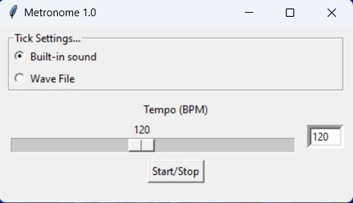

# PyMetronome

Um simples metrônomo, feito em Python, para estudar música.


## Screenshots




## Instalação

O ideal é criar um ambiente virtual com o Python 3.12.

Instale PyMetronome com pip após clonar o projeto.

```bash
  pip install -r requirements.txt
```


Execute o código com:
```bash
  python main.py
```
    
## Criando executável

```bash
pyinstaller --onefile --windowed --add-data "click.wav;." --icon="metronome.ico" main.py
```

